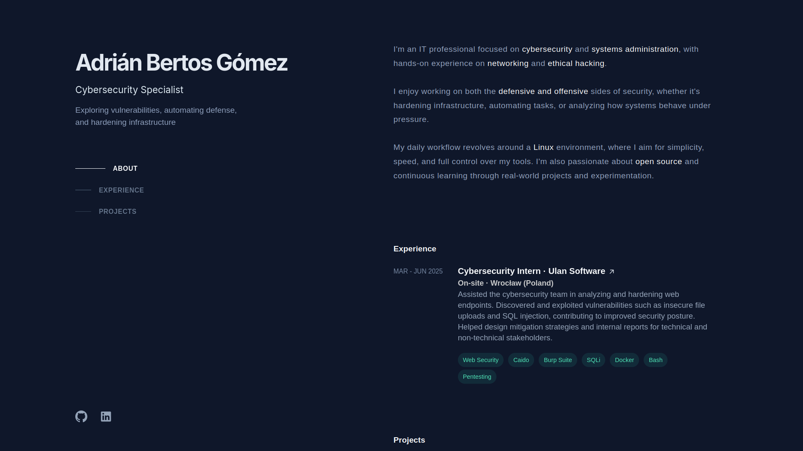

# pumukydev.com

<p align="center">
    
</p>

## 📦 Requirements

- [Docker](https://www.docker.com/)
- [Docker Compose](https://docs.docker.com/compose/)

## 🛠️ Setup Instructions

### 1. Clone the repository

```bash
git clone https://github.com/PumukyDev/pumukydev.com.git
cd pumukydev.com
```

### 2. Configure the web

1. Copy the environment file:

   ```bash
   cp ./app/.env.example ./app/.env
   ```

2. Edit the `.env` file:

   - Add your **GitHub token** (you can generate one [here](https://github.com/settings/tokens)). It only needs `public_repo` permissions.
   - Add your **GitHub username**.

3. Replace the content in `/app/templates/index.html` and other static files to reflect your own work and personal info.

### 3. Deploy the server

```bash
docker-compose up -d --build
```

### 4. See the web

Visit [http://localhost:8000](http://localhost:8000)

If you want to deploy it publicly, check this guide where I explain how to self-host it:  
👉 [https://github.com/PumukyDev/self-hosting](https://github.com/PumukyDev/self-hosting)

## 🔁 Fork this project

If this template was useful to you:

- Fork it and make it your own
- Replace the content with your personal data
- Don’t forget to **mention** `@PumukyDev` if you use or get inspired by it — I’d love to see your version!
- Contributions and stars are always welcome 🤍

## 📄 License

This project is open-source and available under the [MIT License](LICENSE).
